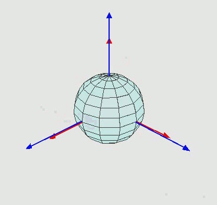

# imu

Collection of notes / code for IMU. <https://oduerr.github.io/gesture/index.html>

-   Note on rotations and quaterions <https://oduerr.github.io/gesture/Note_on_Quaternion.html>

[{width="400"}](https://en.wikipedia.org/wiki/Euler_angles)

{width="505"}

##### Below Experiment Notes

[@grossekatthofer2012introduction]
